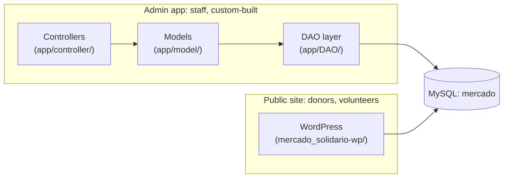

<div align="center">
  
</div>
<br/>

<p align="center">
  
  
  
  
</p>

# Mercado Solidário

Digitized a community food distribution program in Tatuí, SP that ran entirely on spreadsheets: family registration, stock control, and donor point tracking, into a two-sided PHP + MySQL system with a public WordPress site in front of it.

## Two audiences, two codebases

The repo covers both sides on purpose, they solve different problems:



- **Public site**: WordPress, chosen so non-technical staff can edit program info, donation instructions, and volunteer sign-up without a developer
- **Admin app**: hand-rolled PHP, no framework, own DAO/Model/Controller layers over PDO. `CadastroDao`, `ProdutoDao`, `MarcaDao` each own their SQL, models stay framework-free, controllers (`ProcessaCadastra`, `ProcessaEdita`, ...) glue requests to actions

This split is the actual engineering decision here: not "picked WordPress," but "picked WordPress for the half of the problem it's good at, and wrote the other half by hand because the point/stock logic is specific to this program."

## What it replaced

Before this, donor registration, family enrollment, stock counts, and point calculations lived in spreadsheets and paper records, no real-time visibility into who was registered, what was in stock, or how many points a family had earned. The admin app gives staff a live, searchable family database, automatic point calculation tied to participation, and stock management, without asking them to touch a spreadsheet formula.

## Repo structure

```
mercado_solidario/
├── app/
│   ├── DAO/            raw PDO queries: CadastroDao, MarcaDao, ProdutoDao, Conexao
│   ├── model/           Cadastro, Marca, Produto
│   └── controller/      ProcessaCadastra, ProcessaEdita, ...
├── cadastro*.php         family/product/brand registration forms
├── consulta_*.php        search/list views
├── edita_*.php           edit views
├── css/ · js/ · img/      front-end assets for the admin app
└── mercado_solidario-wp/  WordPress install for the public-facing site
```

## Known limitations

- No role-based access control yet, one admin login for all staff
- Point calculation rules are hardcoded, changing them means a code change, not a config change
- `app/DAO/Conexao.php` has local dev DB credentials committed (`root`, no password); fine for local development, needs to move to environment variables before any real deployment
- No automated backups at launch

## Run it locally

```bash
git clone https://github.com/edunucleo/mercado_solidario.git
cd mercado_solidario
composer dump-autoload   # PSR-4: app\ -> app/
```

Create a local MySQL database named `mercado`, point `app/DAO/Conexao.php` at it, then serve the root with your PHP dev server of choice. The WordPress site under `mercado_solidario-wp/` runs independently, point it at its own database per the standard WordPress install flow.

---

<sub>☕︎ Made with purpose in Tatuí, SP</sub>
